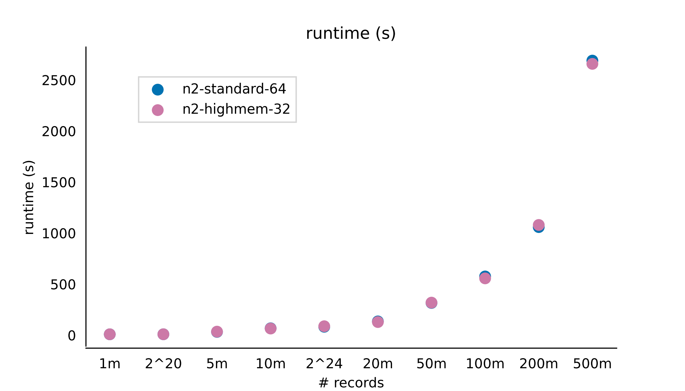
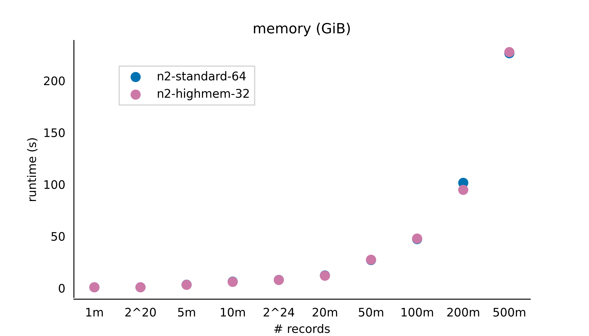
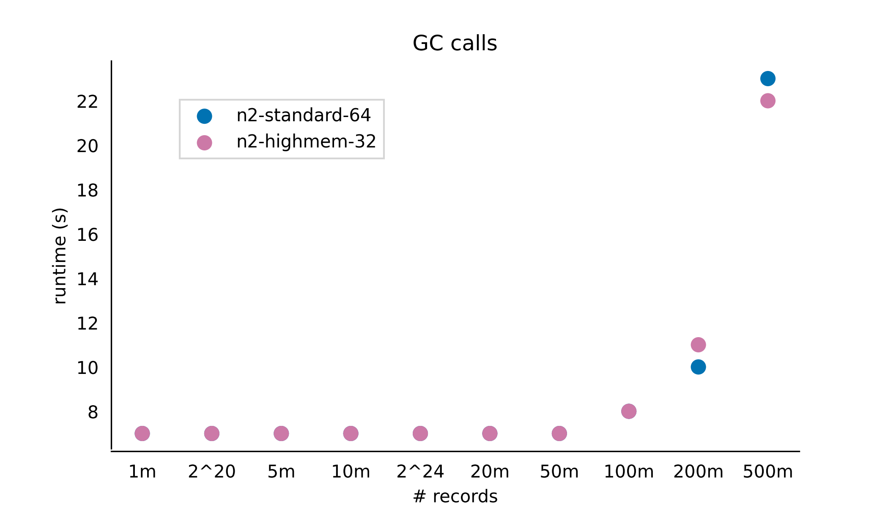

# KKRT Benchmarks

The following scatter plots show the results of benchmarking match attempts using the KKRT PSI algorithms on Google Cloud n2-standard-64 and n2-highmem-32[general-purpose virtual machines (VMs)](https://cloud.google.com/compute/docs/general-purpose-machines#n2_machines). For each benchmark, the sender and the receiver use the same type of VM and have an equal number of records. Note that the performance on n2-standard-64 and n2-highmem-32 is nearly identical.

The heatmaps compare results when sender and receiver use the same type of VM (n2-standard-64) but have differing number of records (50m, 100m, 200m, 300m, 400m and 500m). The receiver's datasets are represented row-wise while the sender's datasets are represented column-wise. 

All match attempts performed have an intersection size of 50m.

## Runtime

  

 

  

## Memory

  

  

  

## GC calls

  

  

  

