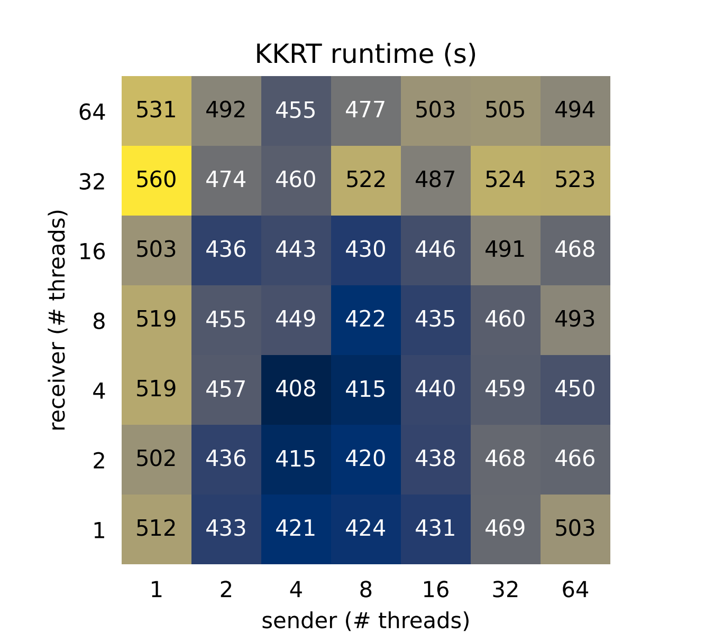

# KKRT Benchmarks

## Runtime with varying system threads
This heatmap compares runtimes when the sender and receiver have been limited to a set number of system threads (on an n2-standard-64 VM). Both sender and receiver have 100m (million) records with an intersection size of 50m. The receiver's datasets are represented row-wise while the sender's datasets are represented column-wise.

  

As shown in the above performance results where the number of system threads is increased, there is an up to 15% improvement in performance from the sender’s perspective, but very little effect on the receiver. Additionally, as the number of system threads is increased beyond approximately 8, there is a slight *degradation* in performance. Since KKRT does not benefit much from multi-thread parallelism, we recommend sizing your hardware primarily according to the memory requirements (see below).

## Memory
These heatmaps compare memory usage when sender and receiver use the same type of VM (n2-standard-64) but have differing number of records (50m, 100m, 200m, 300m, 400m and 500m). The receiver's datasets are represented row-wise while the sender's datasets are represented column-wise. All match attempts performed have an intersection size of 50m. 

  

  

## GC calls
These heatmaps compare number of garbage collector calls when sender and receiver use the same type of VM (n2-standard-64) but have differing number of records (50m, 100m, 200m, 300m, 400m and 500m). The receiver's datasets are represented row-wise while the sender's datasets are represented column-wise. All match attempts performed have an intersection size of 50m.

  

  

