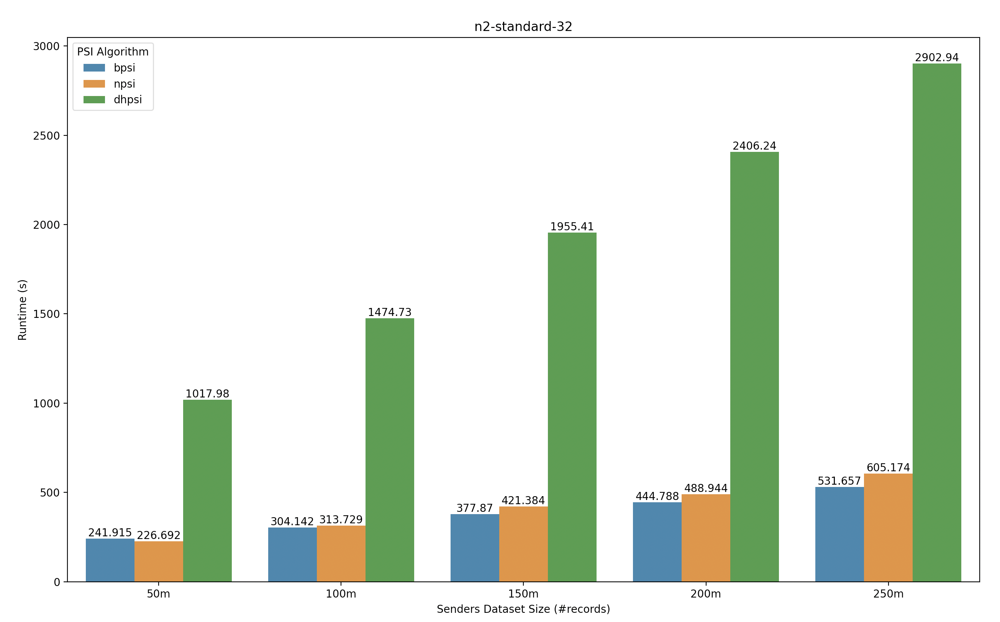
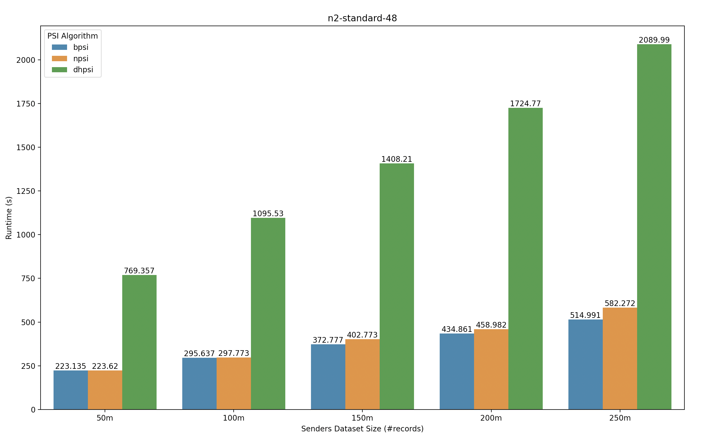
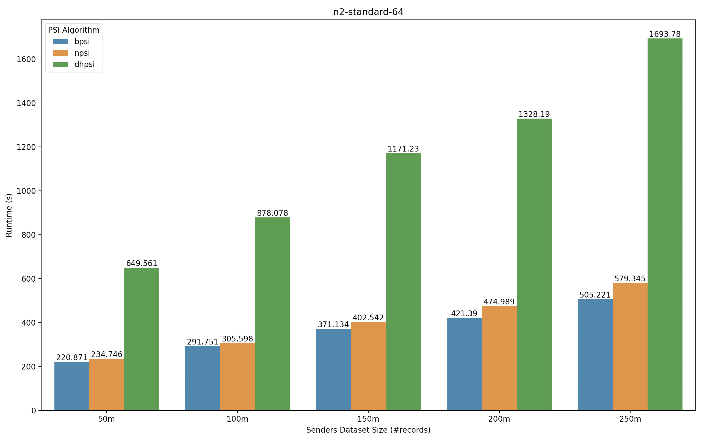
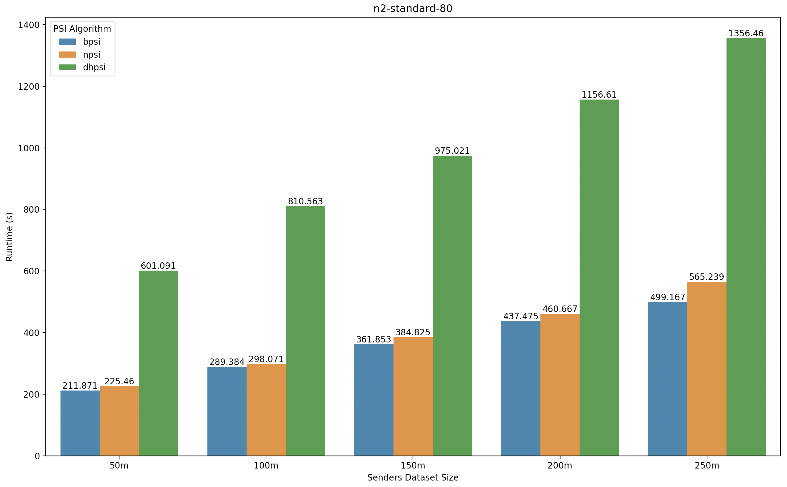

# Benchmark

The following graphs show the benchmark results (runtime (in secs)) of running match attempts, using different PSI algorithms, on various Google cloud general-purpose virtual machines (VMs) like n2-standard-32, n2-standard-48, n2-standard-64 and n2-standard-80. For each experiment, same type of VMs are used for both sender and receiver. The match attempts are performed between a fixed receiver dataset of 50m records and variety of sender datasets of 50m, 100m, 150m, 200m and 250m records each. 

The bpsi used for these experiments has a fixed false positive rate of 1e-6.

