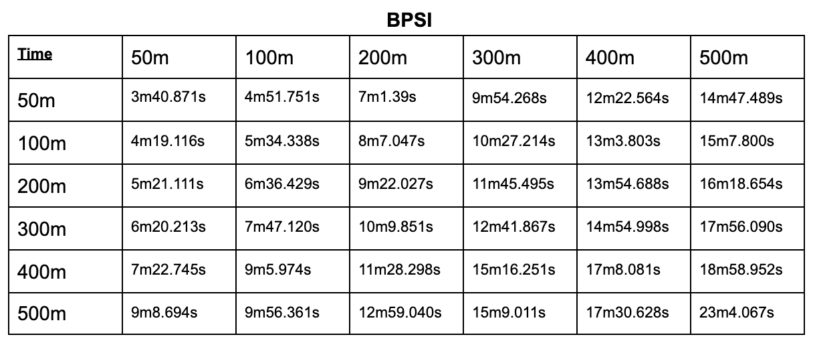
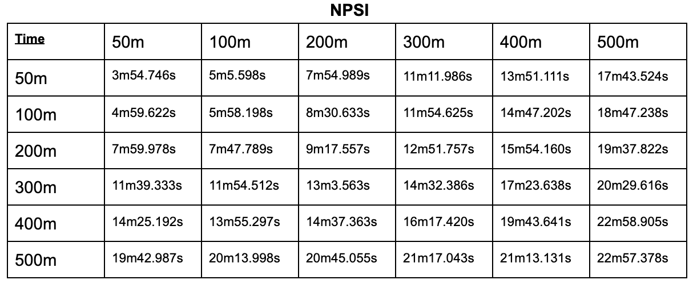
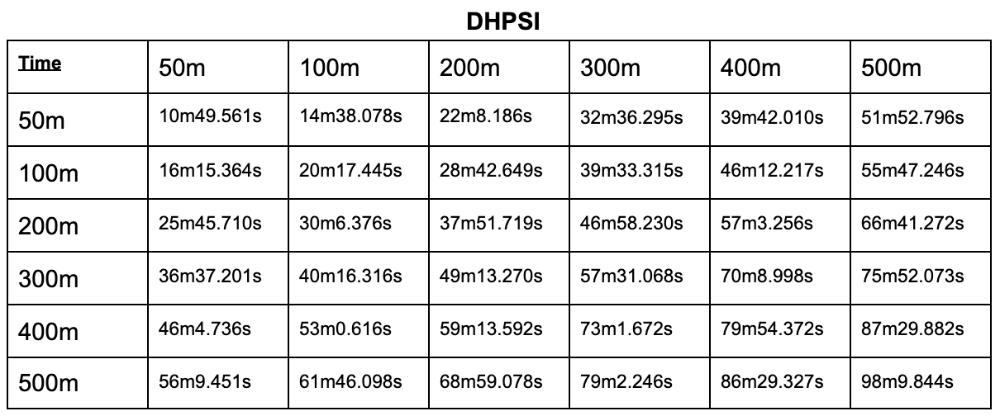

# Benchmarks

1) The following graphs show the benchmark results (runtime (in secs)) of running match attempts, using different PSI algorithms, on various Google cloud [general-purpose virtual machines (VMs)](https://cloud.google.com/compute/docs/general-purpose-machines#n2-standard) like n2-standard-32, n2-standard-48, n2-standard-64 and n2-standard-80. For each experiment, same type of VMs are used for both sender and receiver. The graphs are generated by performing  match attempts between a fixed receiver dataset of 50m records and variety of sender datasets of 50m, 100m, 150m, 200m and 250m records each. The bpsi used for these experiments has a fixed false positive rate of 1e-6.

2) Further, we provide the running times of performing match attempts using different PSI algorithms on n2-standard-64 VMs between a variety of receiver datasets [50m, 100m, 200m, 300m, 400m and 500m records] and a variety of senders datasets [50m, 100m, 200m, 300m, 400m and 500m records].

