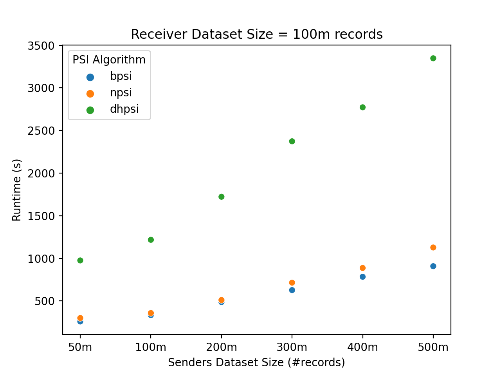
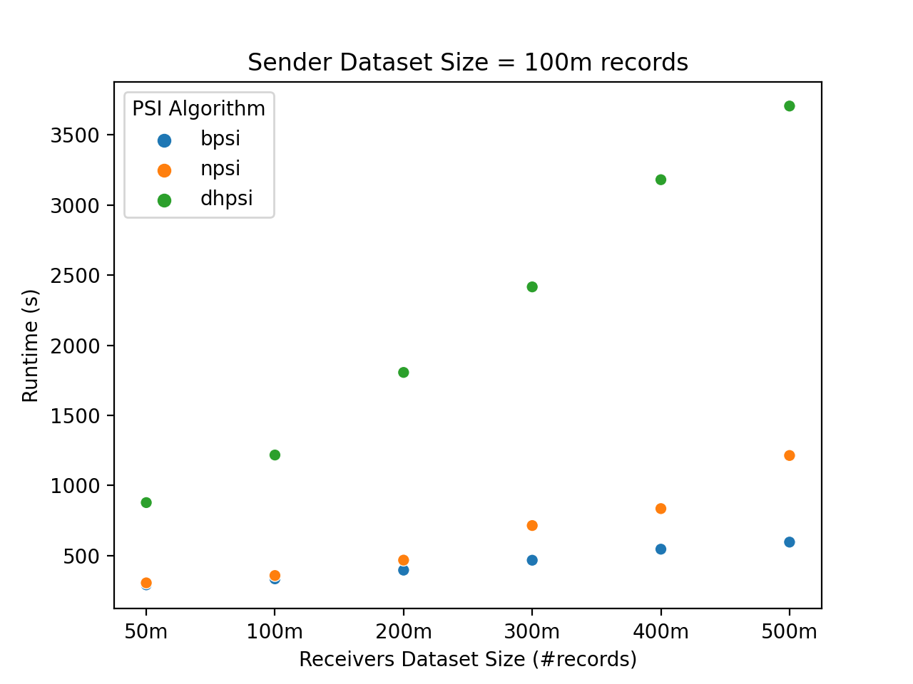

# Benchmarks

The following scatter plots show the results of benchmarking match attempts using different PSI algorithms on Google Cloud n2-standard-64 [general-purpose virtual machines (VMs)](https://cloud.google.com/compute/docs/general-purpose-machines#n2-standard). For each benchmark, the sender and receiver use the same model VM. In the first plot, the receiver has 100m records while the sender has varying datasets of 50m, 100m, 200m, 300m, 400m and 500m records where as in the second plot, the sender's dataset is of 100m records while the receiver has varying datasets of 50m, 100m, 200m, 300m, 400m and 500m records. The BPSI used for these experiments has a false positive rate fixed at 1e-6. 

The results for match attempts using different PSI algorithms are provided below. Both sender and receiver used n2-standard-64 VMs with datasets containing 50m, 100m, 200m, 300m, 400m and 500m records. The receiver's datasets are represented row-wise while the sender's datasets are represented column-wise.

