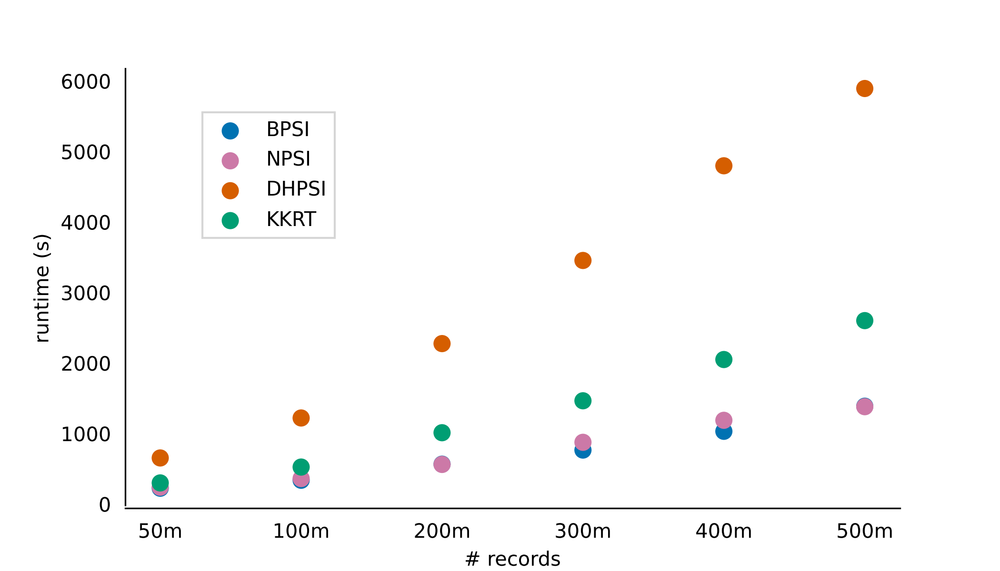
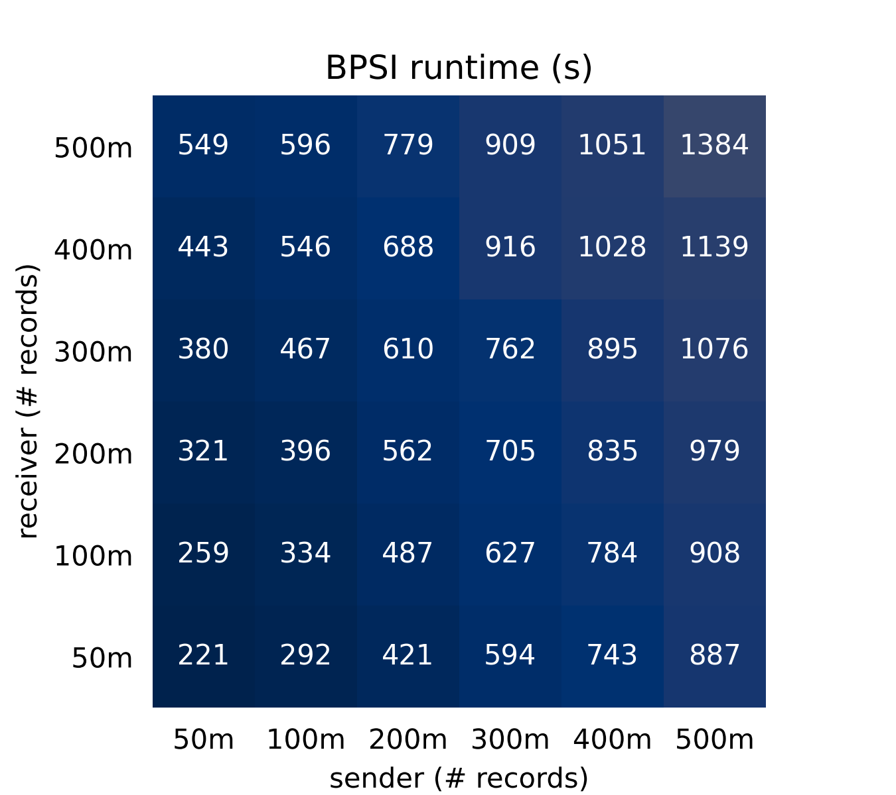
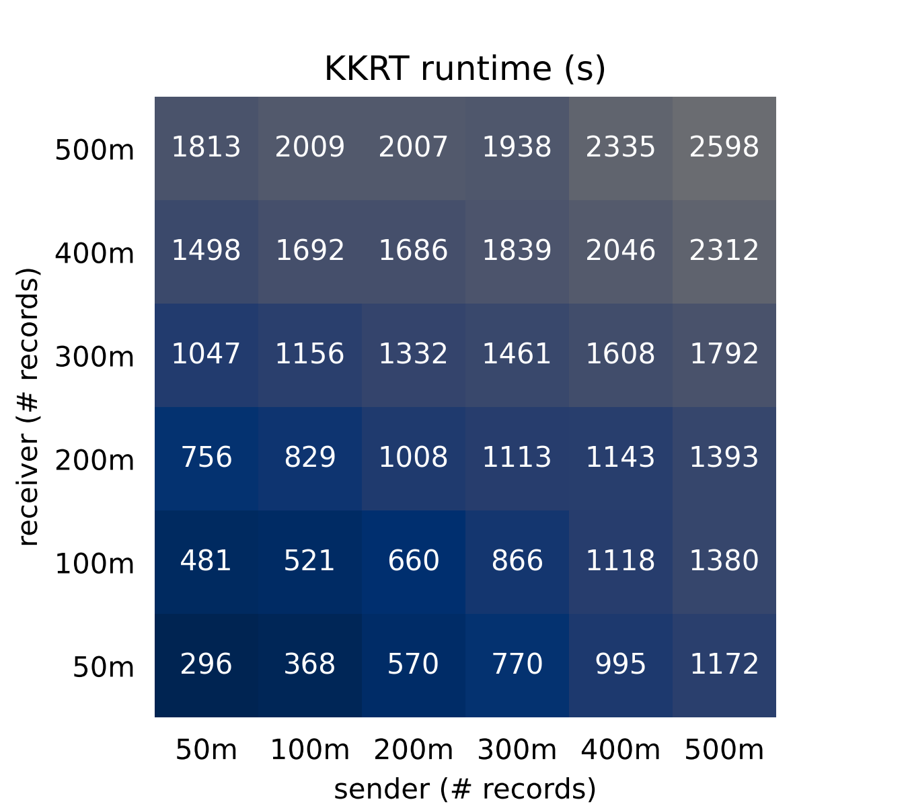
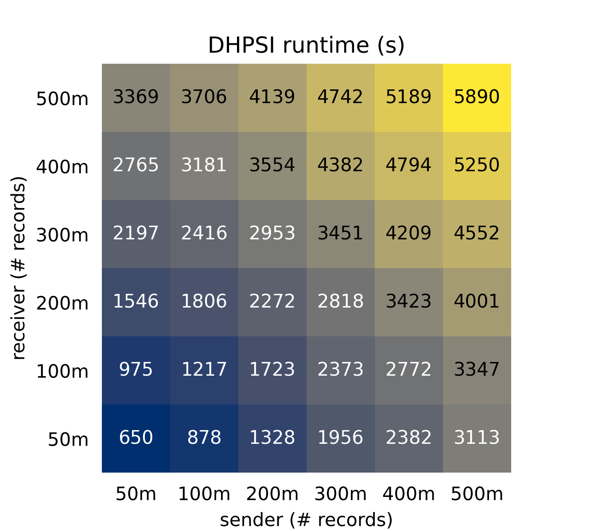
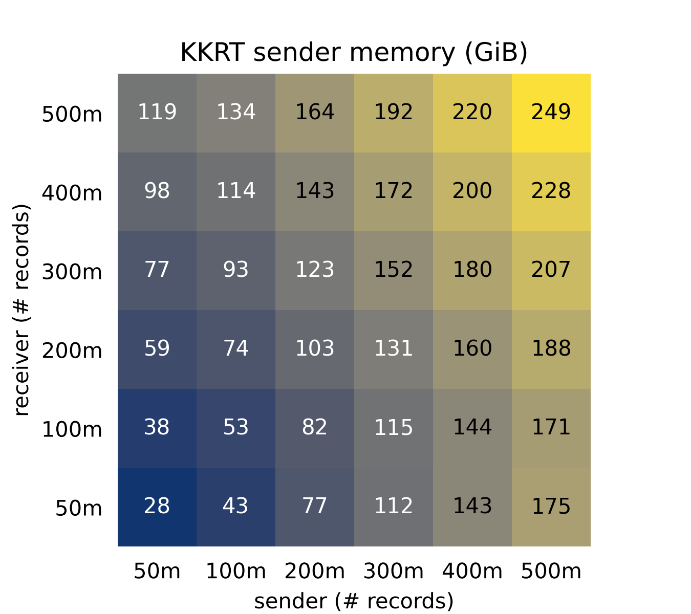
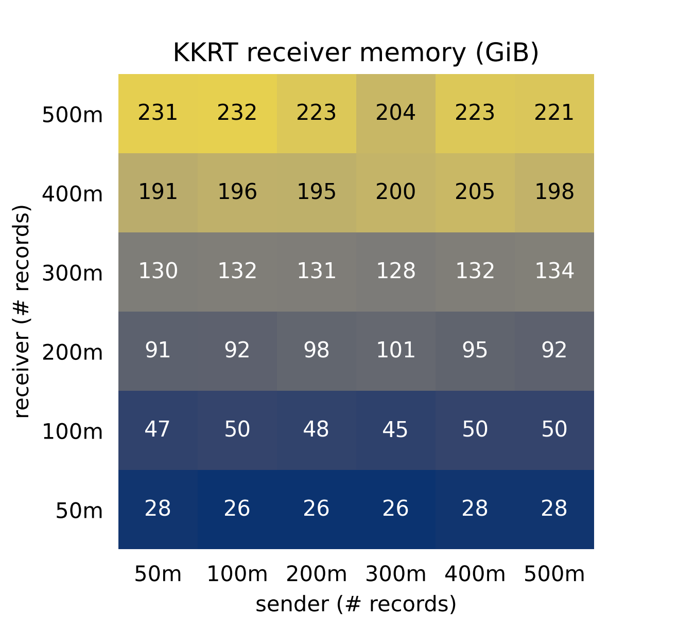
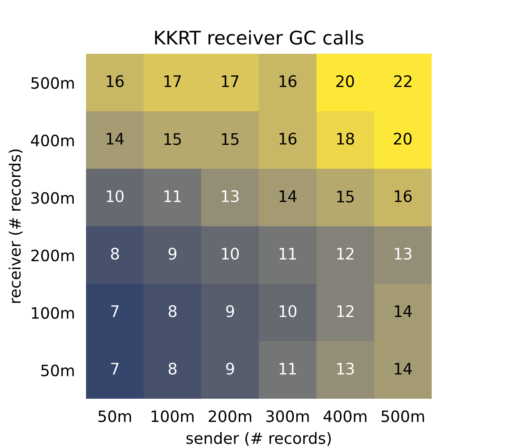

# Benchmarks

## Runtime
The following scatter plots show the results of benchmarking match attempts using different PSI algorithms on Google Cloud n2-standard-64 [general-purpose virtual machines (VMs)](https://cloud.google.com/compute/docs/general-purpose-machines#n2-standard). For each benchmark, the sender and the receiver use the same type of VMs. The first plot shows runtime for various PSI algorithms when the sender and receiver have an equal number of records. The BPSI used for these experiments has a false positive rate fixed at 1e-6. All the match attempts performed have an intersection size of 50m.

  

The runtimes for match attempts using different PSI algorithms are provided below. Both sender and receiver used n2-standard-64 VMs with datasets containing 50m, 100m, 200m, 300m, 400m and 500m records. The receiver's datasets are represented row-wise while the sender's datasets are represented column-wise.

  

  

  

  

## Memory
The memory used by sender and receiver is provided below for the KKRT protocol. Both sender and receiver used n2-standard-64 VMs with datasets containing 50m, 100m, 200m, 300m, 400m and 500m records. The receiver's datasets are represented row-wise while the sender's datasets are represented column-wise.

  

  

## GC calls
The number of GC calls performed by sender and receiver is provided below for the KKRT protocol. Both sender and receiver used n2-standard-64 VMs with datasets containing 50m, 100m, 200m, 300m, 400m and 500m records. The receiver's datasets are represented row-wise while the sender's datasets are represented column-wise.

  

  

